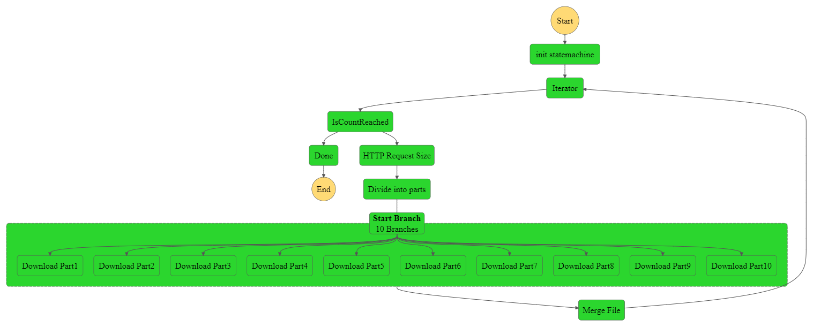

# AWS_multithread-statemachine
**A fast, efficient, multithreaded statemachine based on AWS.**

**AWS SAM x Python**
## Table of Contents
TBC
- 2023/01/07 template TBC
- 2023/01/09 template TBC
<!-- - [Getting Started](#getting_started)
- [Prerequisites](#prerequisites)
- [Building AWS SAM application](#build)
- [Deploying AWS SAM application](#deploy)
- [Testing AWS SAM application](#test)
- [Author](#author) -->

<!-- ## Getting Started <a name = "getting_started"></a>

These instructions will walk you through building an AWS SAM application with CloudFormation template.

### Prerequisites <a name = "prerequisites"></a>

1. Configure AWS command line interface credentials.

```sh
$ aws configure
AWS Access Key ID [None]: ********************
AWS Secret Access Key [None]: ********************
Default region name [None]: **-****-*
Default output format [None]: ****
```

2. Install **AWS SAM command line interface**, please refer to the following link: https://docs.aws.amazon.com/serverless-application-model/latest/developerguide/serverless-sam-cli-install.html


## Building AWS SAM application <a name = "build"></a>

A step by step guide that tells you how to build an AWS SAM application with AWS SAM command line interface.

1. Switch to the /sam-app path.

```sh
$ cd sam-app
```

2. Build the sam application.

```sh
$ sam build
```
## Deploying AWS SAM application <a name = "deploy"></a>

1. When you see **Build Succeeded** from the last step, deploy the sam application to AWS cloud.

```sh
$ sam deploy --guided
```
```sh
$ Configuring SAM deploy
Stack Name [sam-app]: SAM-aemass-qe-dev
AWS Region [us-east-1]: us-east-1
Confirm changes before deploy [y/N]: y
Allow SAM CLI IAM role creation [Y/n]: Y
Disable rollback [y/N]: y
QETriggerFunction may not have authorization defined, Is this okay? [y/N]: y
Save arguments to configuration file [Y/n]: Y
SAM configuration file [samconfig.toml]: samconfig.toml
SAM configuration environment [default]: default
```
```sh
$ Previewing CloudFormation changeset before deployment
Deploy this changeset? [y/N]: y
```
2. As long as all resources are created, you will see the following output.

```sh
Outputs
Key                 ApiEvent
Description         API Gateway endpoint URL for triggering QE engine.
Value               https://**********.execute-api.us-east-1.amazonaws.com/processes
```

## Testing AWS SAM application <a name = "test"></a>

Now you can trigger the AWS SAM application through the **API Gateway Endpoint URL** with **HTTP POST** method.

## Author <a name = "author"></a>

- Jeffrey Wang ( jeffrey02120212@gmail.com ) -->